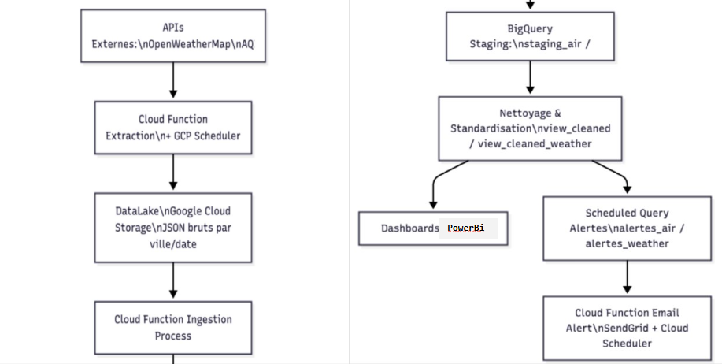

#  Création d'une platforme Big Data pour la qualité de l’air

##  Objectif
Mettre en place une **plateforme Big Data scalable et sécurisée** permettant de :
- Collecter automatiquement des données **météo (OpenWeatherMap)** et **qualité de l’air (AQICN)** pour plusieurs grandes villes françaises.
- Nettoyer, transformer et historiser ces données dans un **Data Lake** et un **Data Warehouse**.
- Fournir des **KPI environnementaux** (AQI, PM10, PM2.5, NO2, O3, températures, humidité…).
- Détecter automatiquement les **dépassements de seuils critiques** et générer des alertes.
- Restituer les résultats via des **dashboards interactifs** pour les chercheurs, analystes et décideurs.

##  Stack technique
- **Google Cloud Platform (GCP)**
  - Cloud Storage → Data Lake (stockage brut JSON)
  - BigQuery → Data Warehouse & DataMarts
  - Cloud Functions → ETL serverless (extraction, transformation, ingestion)
  - Cloud Scheduler → automatisation des flux
  - Gmail SMTP / SendGrid → alerting automatique
- **Power BI** → visualisation et dashboards
- **GitHub + Trello + Microsoft Teams** → gestion de projet et collaboration:contentReference[oaicite:2]{index=2}

##  Architecture
Pipeline de données automatisé :
1. **Extraction** (APIs OpenWeatherMap & AQICN via Cloud Functions)
2. **Ingestion** dans BigQuery (tables de staging)
3. **Nettoyage & enrichissement** (SQL, gestion des données manquantes, calcul d’alertes)
4. **DataMarts** agrégés par ville/jour
5. **Visualisation** avec Power BI (indicateurs et dashboards dynamiques)
6. **Monitoring & alertes** (Cloud Functions + Scheduler + Gmail/SendGrid)

##  Résultats
- Tableaux de bord interactifs pour suivre :
  - L’évolution de la pollution de l’air et de la météo
  - Les dépassements de seuils réglementaires (PM2.5, PM10…)
  - Les tendances (pics de pollution, canicules, humidité, etc.)
- **Module de Machine Learning (Random Forest via BigQuery ML/Vertex AI)** pour prédire les épisodes de pollution et déclencher des alertes préventives:contentReference[oaicite:3]{index=3}.
- **Automatisation complète** du pipeline (extractions horaires, nettoyage, agrégation, alertes quotidiennes).
- **Conformité RGPD** (hébergement en UE, chiffrement TLS, gestion stricte des accès):contentReference[oaicite:4]{index=4}.

Date : **29/06/2025**

---

*Ce projet démontre ma capacité à concevoir, déployer et opérer une architecture Big Data cloud-native, de la collecte de données temps réel jusqu’à la visualisation et la prédiction, avec un fort impact environnemental et sociétal.*
